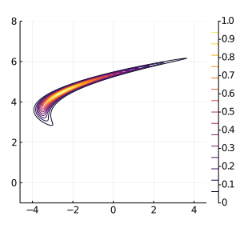
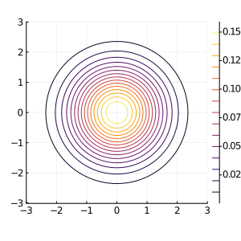
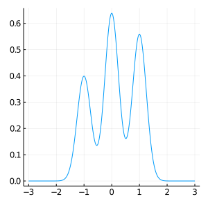
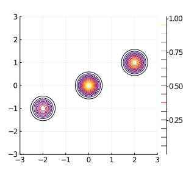
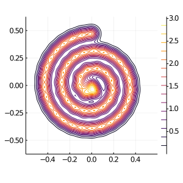
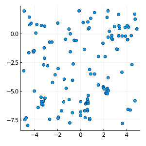
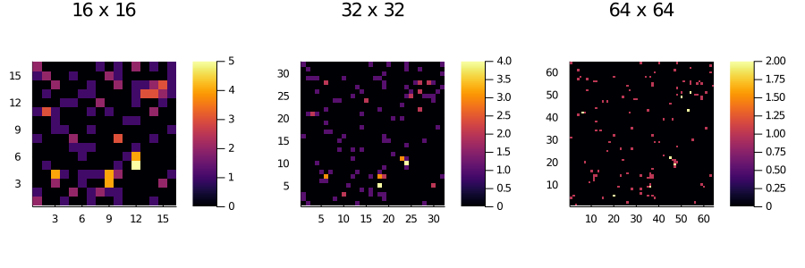

# VecTargets.jl

This package contains common target distributions in Bayesian inference with vectorized log-density and gradient evaluation supported.

Targets included are

- Banana distribution 
  
  
- Multivariate diagonal Gaussian 
  
  
- Mixture of Gaussians 
  
   
  
- Spiral distribution 
  
  
- Logistic regression on the [German credit dataset](https://archive.ics.uci.edu/ml/datasets/statlog+(german+credit+data))
- Log-Gaussian Cox point process on the [Finnish pine saplings dataset](https://rdrr.io/cran/spatstat.data/man/finpines.html)
  - Dataset raw
    
    
  - Dataset processed
    
    
  - Note the visualizations above are NOT the posterior but just datasets.

## A minimal example

```julia
target = Banana()
x = randn(dim(target))
@info logpdf(target, x)         # -433.1
@info logpdf_grad(target, x)    # (-433.1, [646.1, 129.8])
batch = 2
x = hcat(x, randn(dim(target), batch))
@info logpdf(target, x)         # [-433.1, -433.1]
@info logpdf_grad(target, x)    # ([-433.1, -433.1], [646.1 646.1; 129.8 129.8])
```

## A note on the gradient interface

All targets supports `logpdf_grad(target, x::VecOrMat)` which returns a tuple of log-densities and its gradients.
The gradient in most of the cases (if I didn't hand-code them) are computed via ReverseDiff.jl, which compiles a tape for the gradient.
Thus, if you were to call the gradient multiple times, you can potentially save the compilation time by avoiding calling `logpdf_grad` directly, but instead
```julia
gradfunc = gen_logpdf_grad(target, x)
gradfunc(x) # 1st time
gradfunc(x) # 2nd time
            # ...
```
Also note that `gen_logpdf_grad` still expects the second argument `x::Union{AbstractVecotr, AbstractMatrix}` to correctly dispatch on vectorized mode or not.
